

## Experiments with robust classifier

## Experiments with CLIP
Prompt: Big eyes

  

    
    
 Reference 

  

  

    
    
 CSGM 

  

  

    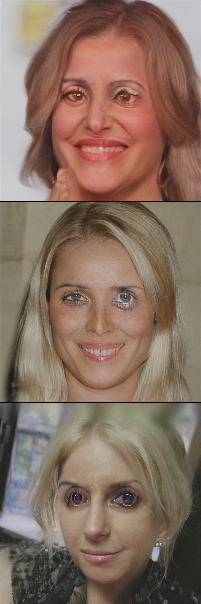
    
 ILO 

  

  

    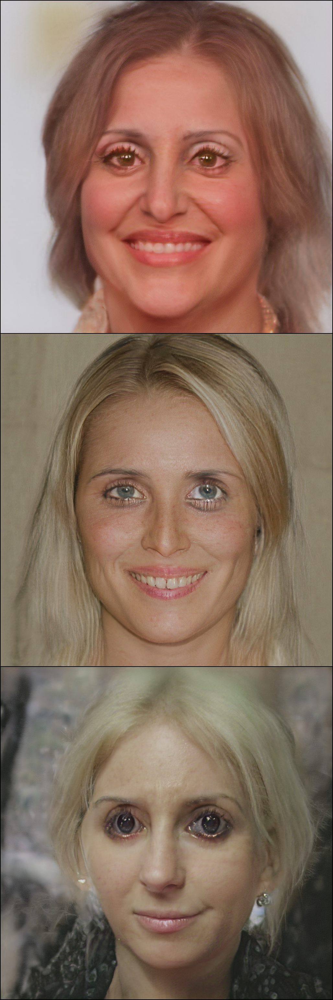
    
 ILO-v2 

  

Prompt: Sad face

  

    
    
 Reference 

  

  

    
    
 CSGM 

  

  

    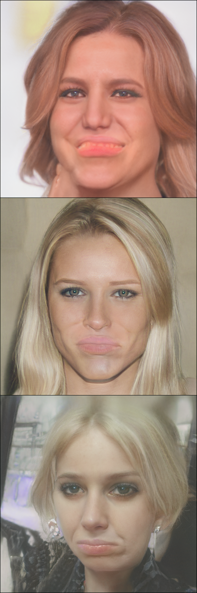
    
 ILO 

  

  

    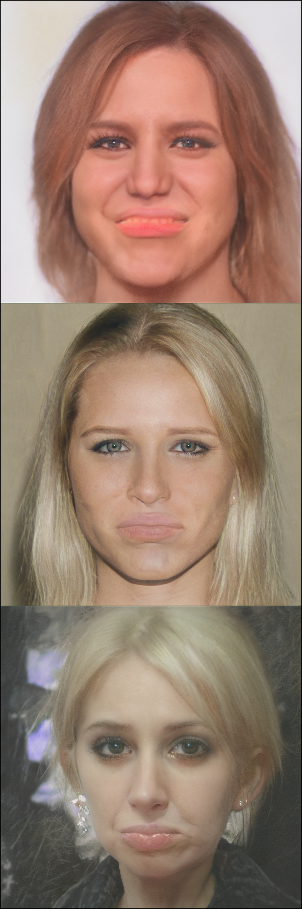
    
 ILO-v2 

  

Prompt: Happy face

  

    
    
 Reference 

  

  

    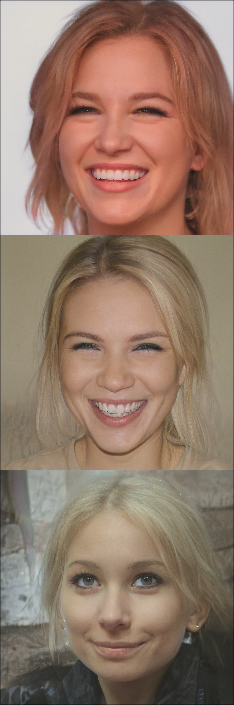
    
 CSGM 

  

  

    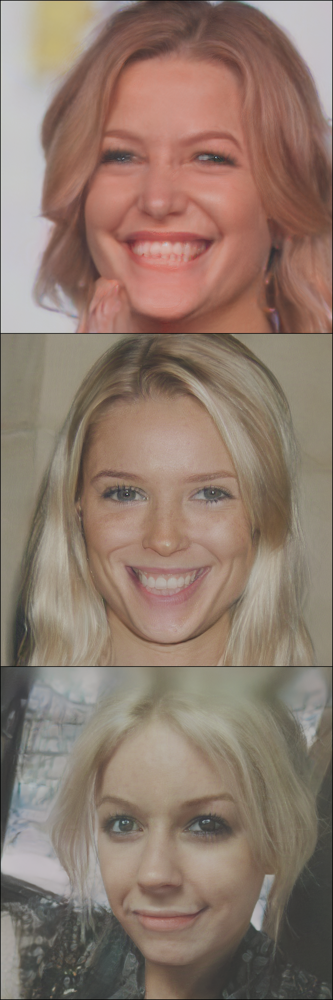
    
 ILO 

  

  

    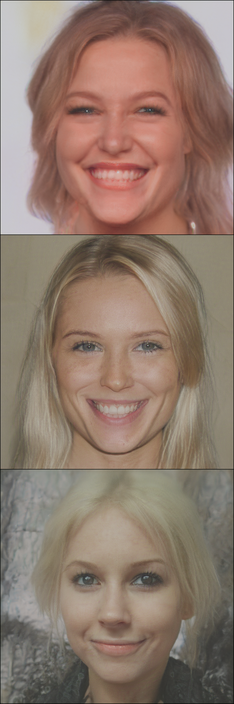
    
 ILO-v2 

  

Prompt: No teeth

  

    
    
 Reference 

  

  

    
    
 CSGM 

  

  

    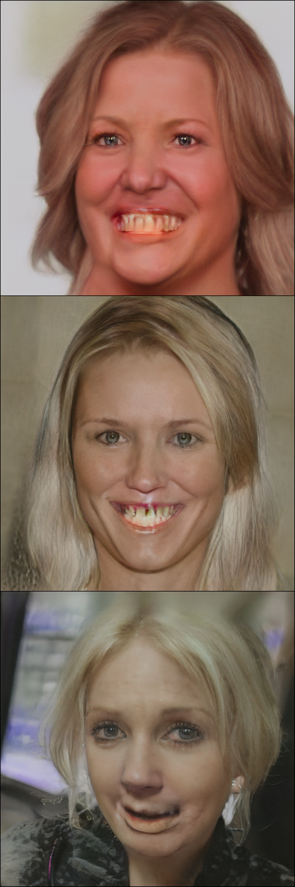
    
 ILO 

  

  

    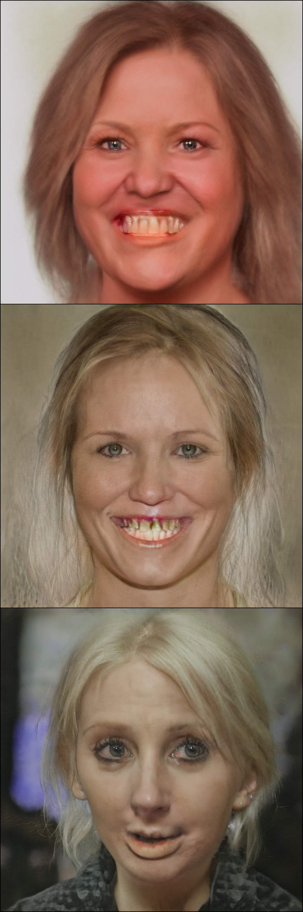
    
 ILO-v2 

  

<!-- Clip prompt: "A man with red lipstick"

  

    
    
 Reference 

  

  

    
    
 CSGM 

  

  

    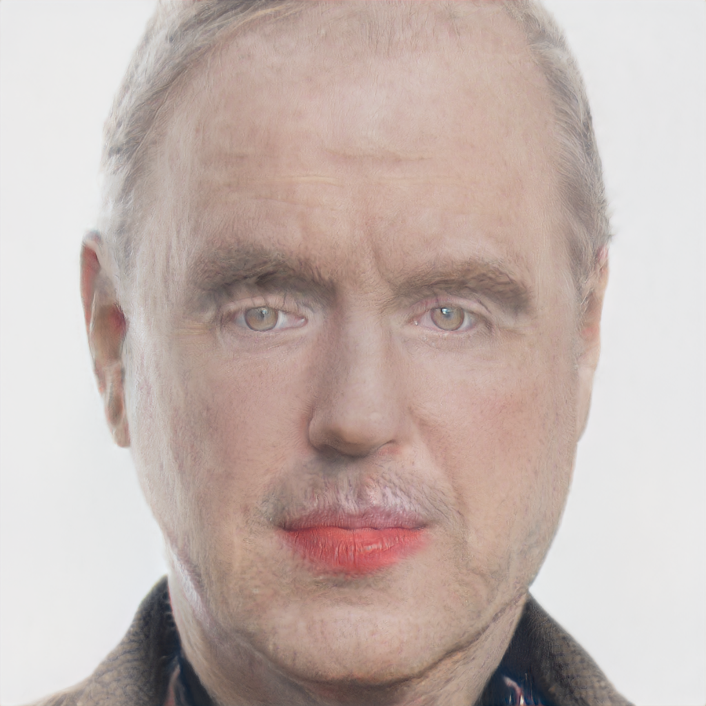
    
 ILO 

  

  

    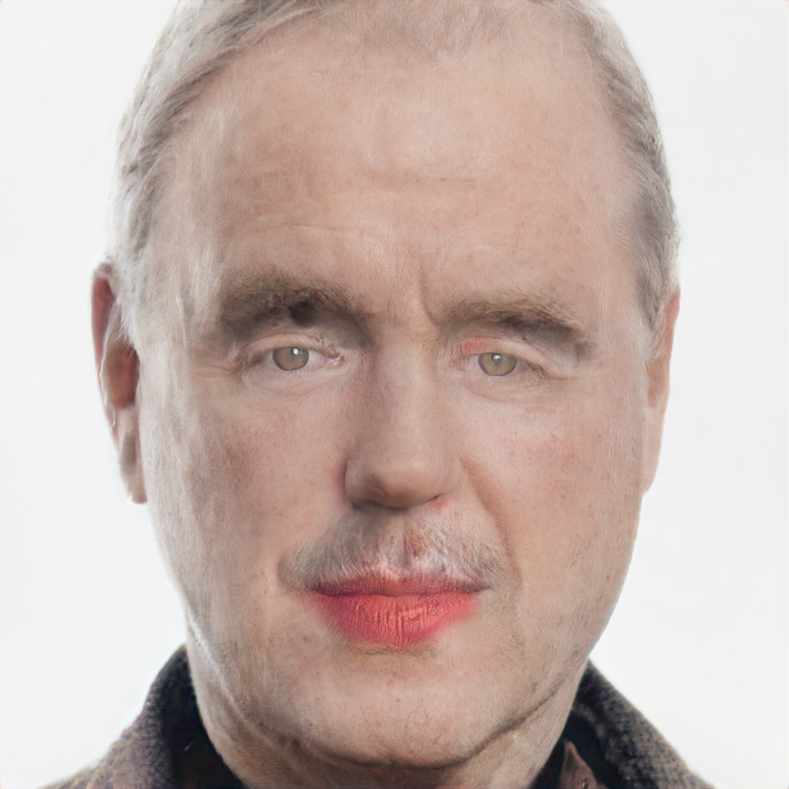
    
 ILO-v2 

  

Clip prompt: "A super sexy girl"

  

    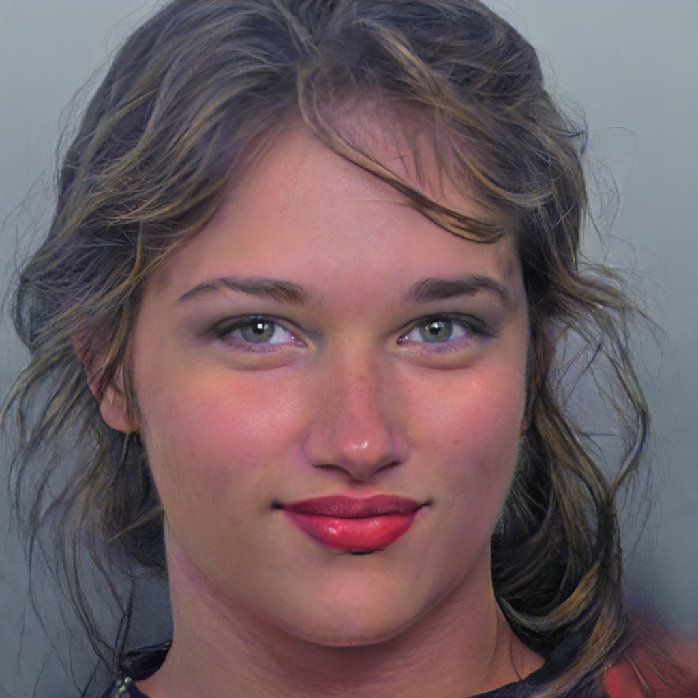
    
 CSGM 

  

  

    
    
 ILO 

  

  

    
    
 ILO-v2 

  

Clip prompt: ["A very sexy woman", "hot woman", "nice smile"]

  

    
    
 CSGM 

  

  

    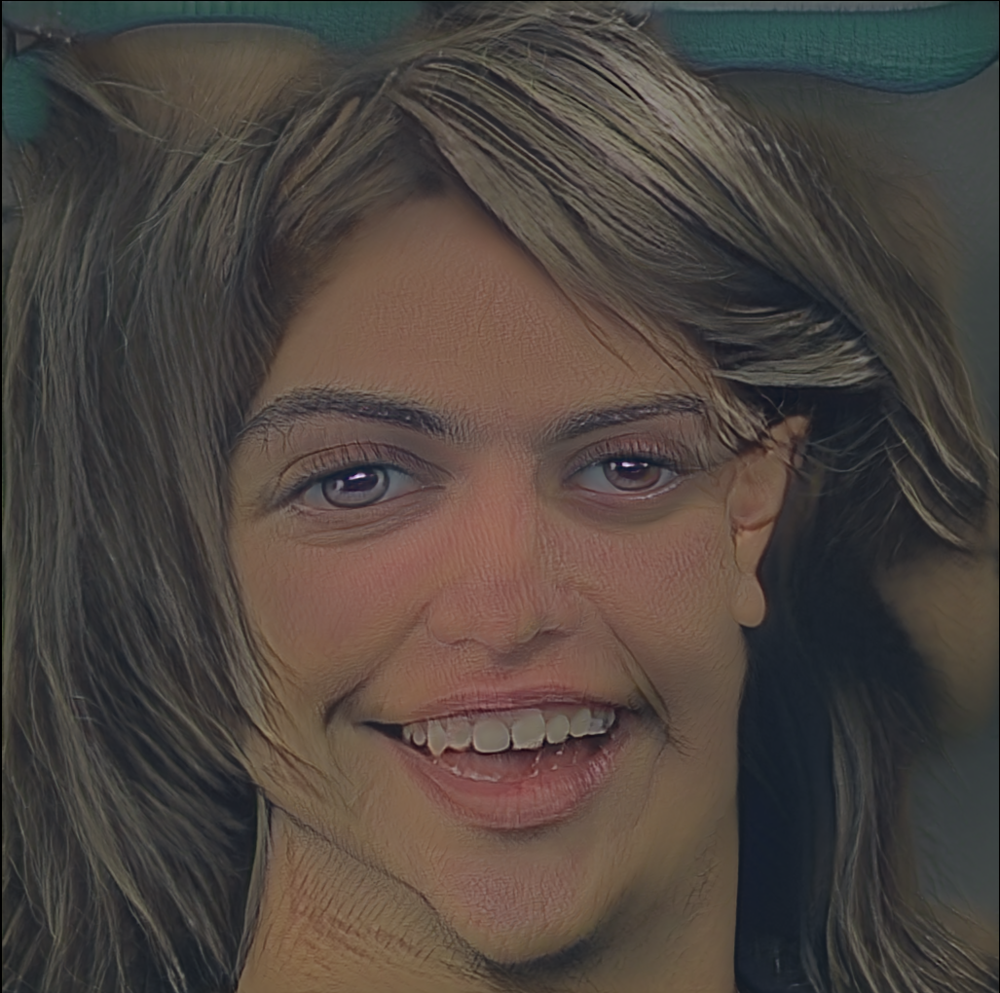
    
 ILO 

  

  

    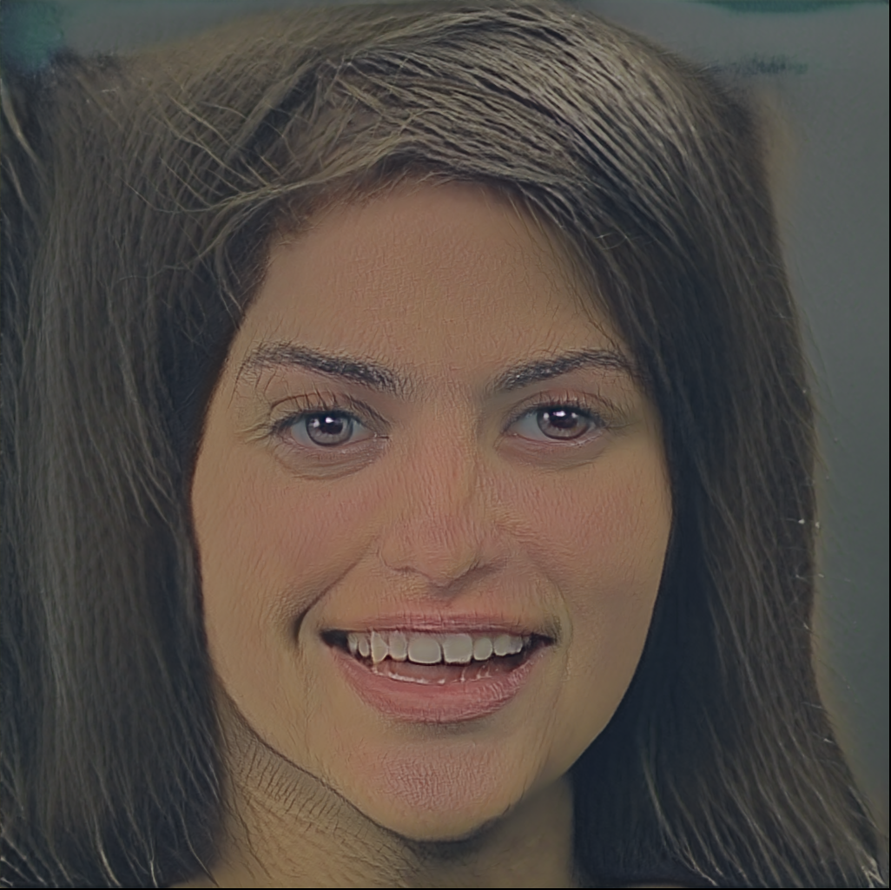
    
 ILO-v2 

  

 -->

<!-- Reference image:

CSGM

ILO

ILO-v2
 -->
