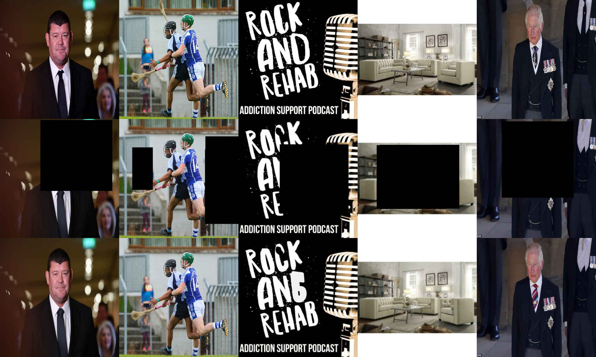
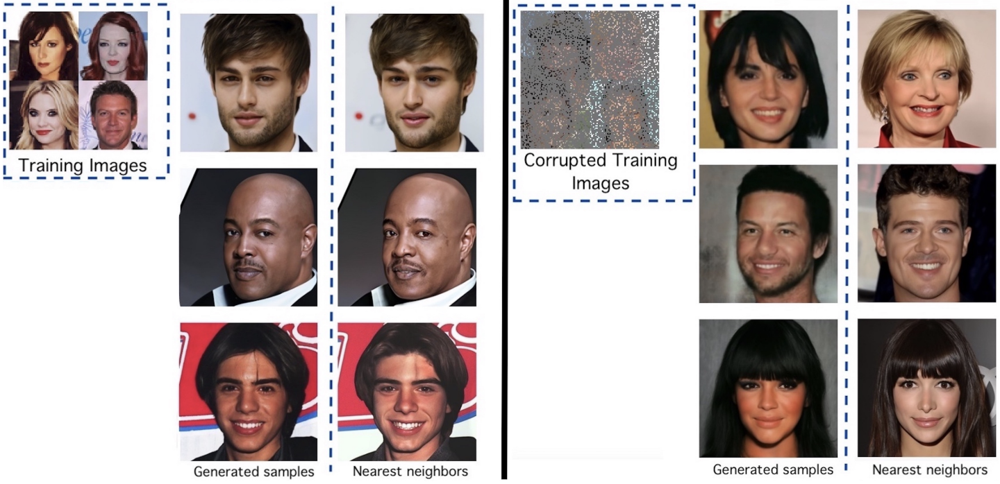
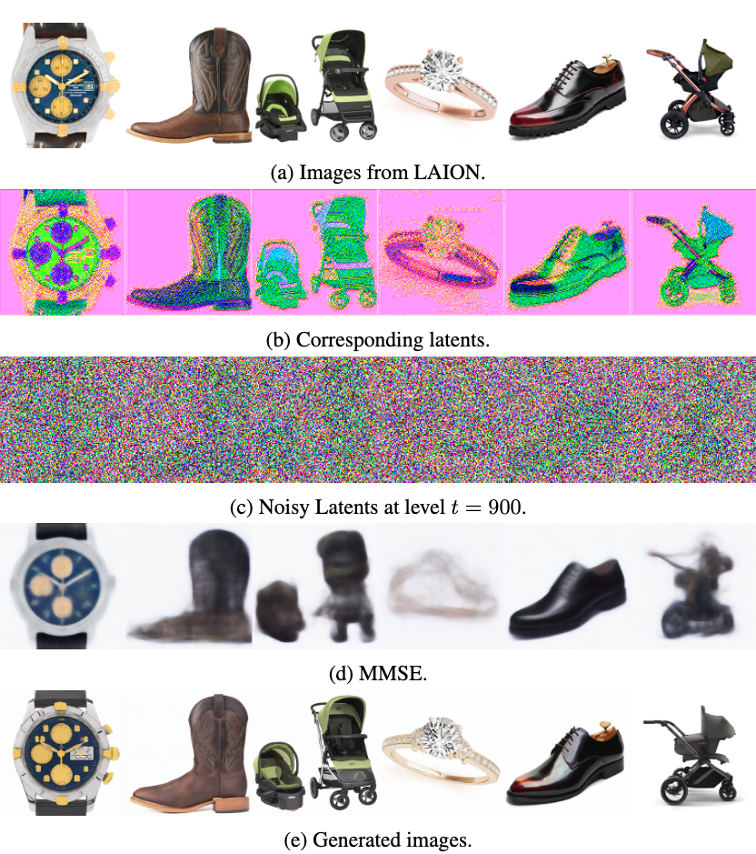
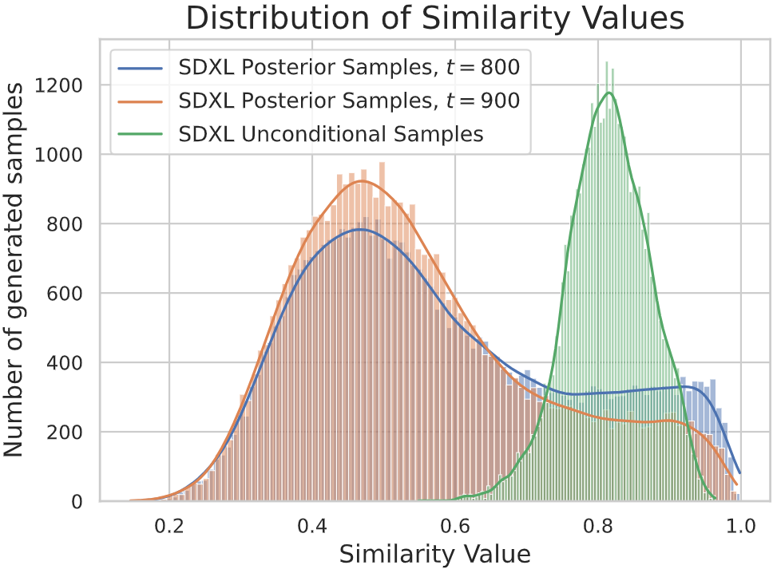
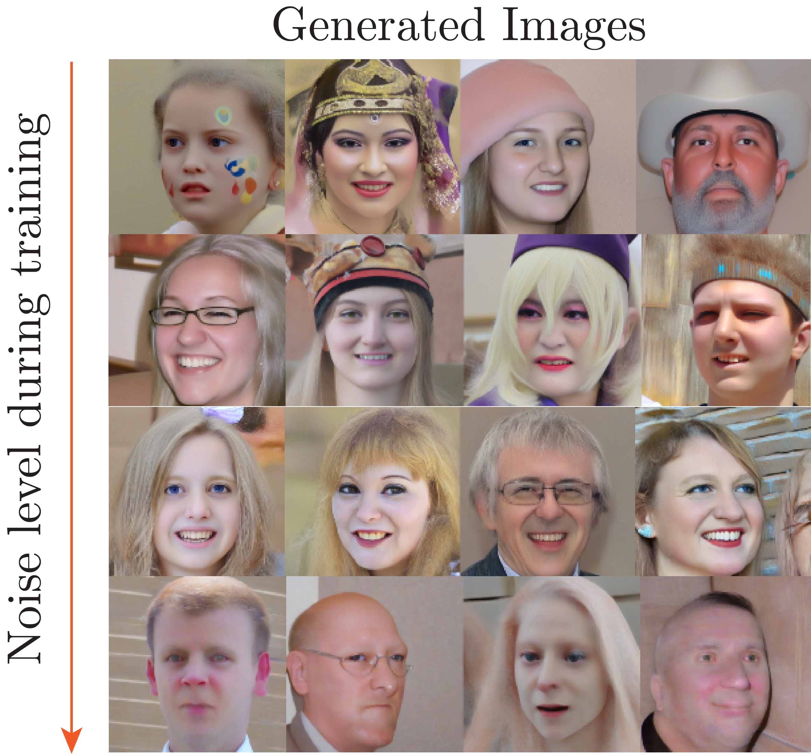
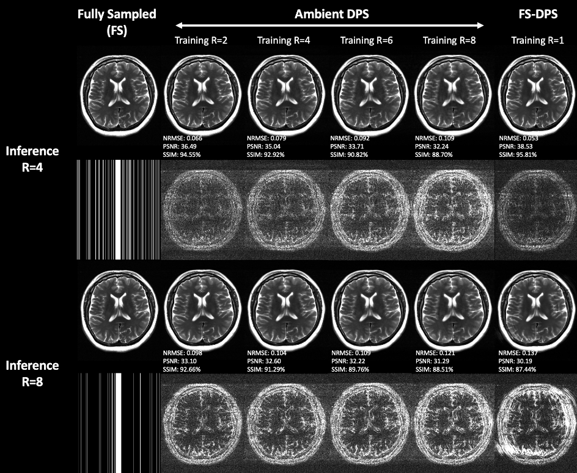

*
Figure 1: SDXL has memorized images from <a href="https://laion.ai/blog/laion-5b/">LAION</a> since it can perfectly reconstruct them given incomplete data.
*

[DALL-E](https://openai.com/dall-e-3), [Midjourney](https://www.midjourney.com/home) and [Stable Diffusion](https://stability.ai/) are powerful text-to-image [diffusion](https://yang-song.net/blog/2021/score/) generative models that can turn arbitrary user prompts into highly realistic images. These models are trained on billions of image-text pairs, and they can generate high-quality images from textual descriptions. However, the dataset used to train these models is not publicly available and potentially contains copyrighted images. Despite the sheer size of their training set, diffusion models are known ([\[1\]](https://arxiv.org/abs/2301.13188), [\[2\]](https://arxiv.org/abs/2212.03860)) to memorize seen examples and replicate them in generated samples. This has led to a series of lawsuits against the major AI research labs that developed these models ([\[3\]](https://www.theverge.com/2023/2/6/23587393/ai-art-copyright-lawsuit-getty-images-stable-diffusion), [\[4\]](https://stablediffusionlitigation.com/), [\[5\]](https://www.nytimes.com/2023/12/27/business/media/new-york-times-open-ai-microsoft-lawsuit.html)).

To reduce the memorization of the training set, researchers at UT Austin in collaboration with UC Berkeley developed the first framework to train diffusion models with only access to corrupted training data. The proposed [**Ambient Diffusion**](https://arxiv.org/abs/2305.19256) framework can be used to generate high-quality samples without ever seeing an uncorrupted image. Ambient Diffusion can be also used in scientific applications where it is expensive or impossible to acquire fully observed or uncorrupted data, such as [black hole imaging](https://imaging.cms.caltech.edu/igm/BH_IGM_CameraReady.pdf) or [MRI acceleration](https://fastmri.med.nyu.edu/). The work is led by the 4th year Computer Science Ph.D. student [Giannis Daras](https://giannisdaras.github.io/) under the supervision of the directors of the [Institue of Foundations of Machine Learning (IFML)](https://www.ifml.institute/), [Alexandros G. Dimakis](https://users.ece.utexas.edu/~dimakis/) and [Adam Klivans](https://www.cs.utexas.edu/users/klivans/).

As their first experiment, the team trained a diffusion model on a set of 3000 images of celebrities. Then, they used the model to generate new samples and compared the generated samples to their nearest neighbor in the dataset.

*
Figure 2: Training with corrupted data reduces the memorization of the training set.
*

The diffusion model trained on clean data blatantly copied the training examples. The team proceeded to corrupt the training data by randomly masking individual pixels and retrained the diffusion model using the Ambient Diffusion framework. The generated samples from the ambient model were found to be sufficiently different from the training examples, as shown in the figure above.

This memorization behavior is not limited to models trained on small datasets. The team demonstrated that state-of-the-art diffusion models, such as [Stable Diffusion XL](https://huggingface.co/docs/diffusers/en/using-diffusers/sdxl) (SDXL), also memorize their training data. They did this by masking significant parts of images that are suspected to be in the training set and using the model as a prior to reconstruct the missing pixels. The reconstructed images are almost identical to the original images, which indicates that the model has memorized them (see Figure 1). The team further showed that the SDXL model can also perfectly reconstruct images that are severely corrupted with additive Gaussian noise.

*
Figure 3: Further evidence that Stable Diffusion XL has memorized images from the <a href="https://laion.ai/blog/laion-5b/">LAION</a> dataset.
*

In collaboration with the MIT Professor [Constantinos Daskalakis](https://people.csail.mit.edu/costis/), the Ambient Diffusion framework (that was originally developed to handle linear corruptions) got extended to train diffusion models on datasets of images that have been corrupted with additive Gaussian noise. The new work, called [Consistent Diffusion Meets Tweedie](../publications/consistent_diffusion_meets_tweedie.pdf), can be used to finetune Stable Diffusion XL on noisy data and significantly reduce the memorization of the training set. 

*
Figure 4: The similarities between the generated samples and the training set are significantly reduced after training with corrupted data.
*

The theory behind the paper predicts that we can train diffusion models that sample from the distribution of interest for any level of corruption. This solves an open-problem in the space of training generative models with corrupted data. The finetuned SDXL Ambient Diffusion models can generate high-quality samples for arbitrary user prompts. 

*
Figure 5: Generations of an Ambient Diffusion SDXL model trained with noisy data at relatively low noise.
*

In practice, performance may degrade for extremely high corruption levels. Yet, the models will never output noisy images.

*
Figure 6: Generations of an Ambient Diffusion SDXL model trained with noisy data at very high noise.
*

<!--  -->
*
Figure 7: Generations of an Ambient Diffusion SDXL model trained with noisy data (at various levels) on FFHQ.
*

The original Ambient Diffusion work has been presented in the top-tier machine learning conference NeurIPS 2023. The code for both papers is available on Github ([\[6\]](https://github.com/giannisdaras/ambient-diffusion), [\[7\]](https://github.com/giannisdaras/ambient-tweedie/)). 

As copyright and privacy concerns are becoming more prevalent in the AI community, Ambient Diffusion can be used to reduce some of these concerns by training diffusion models with corrupted data. It can further have a significant impact on scientific applications that use inherently noisy data. The work has already been applied to train [diffusion models for MRI acceleration](https://arxiv.org/abs/2403.08728) and has shown promising results.

*
Figure 8: Ambient Diffusion for MRI acceleration.
*
