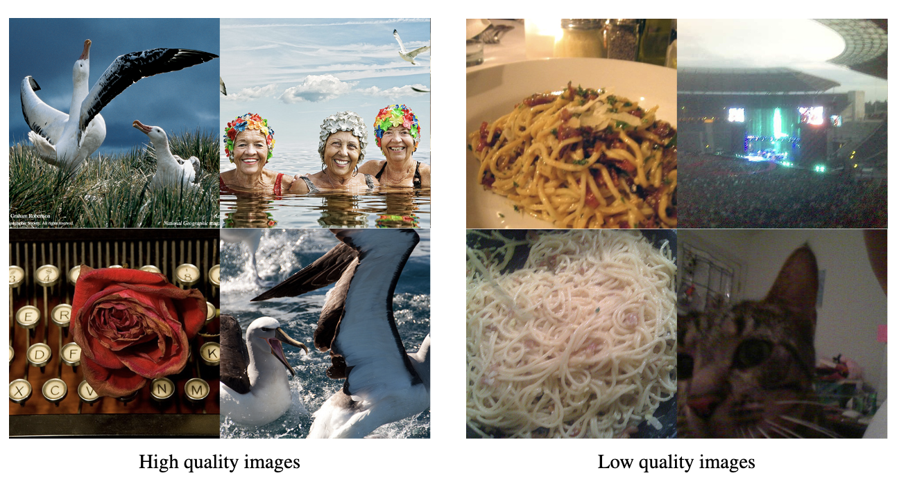
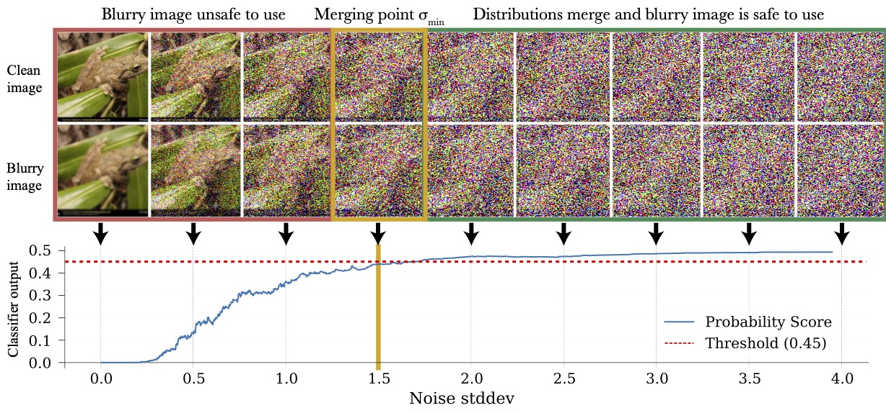
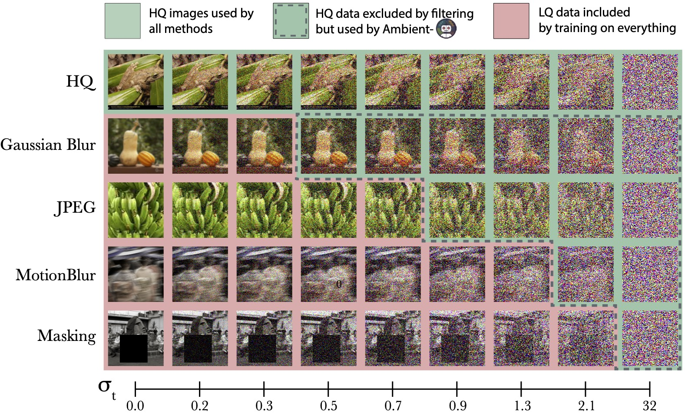
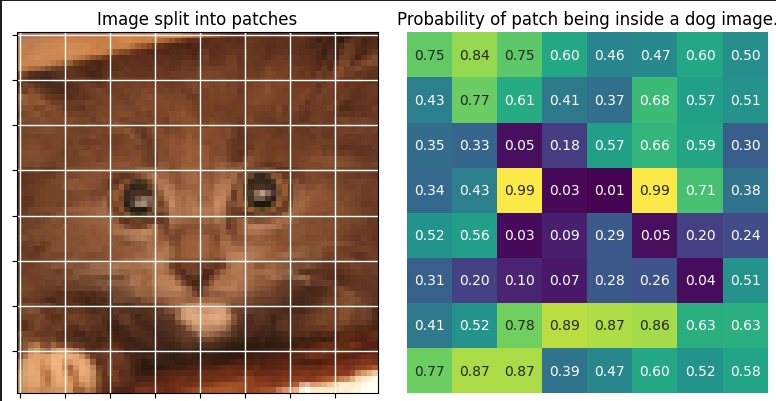
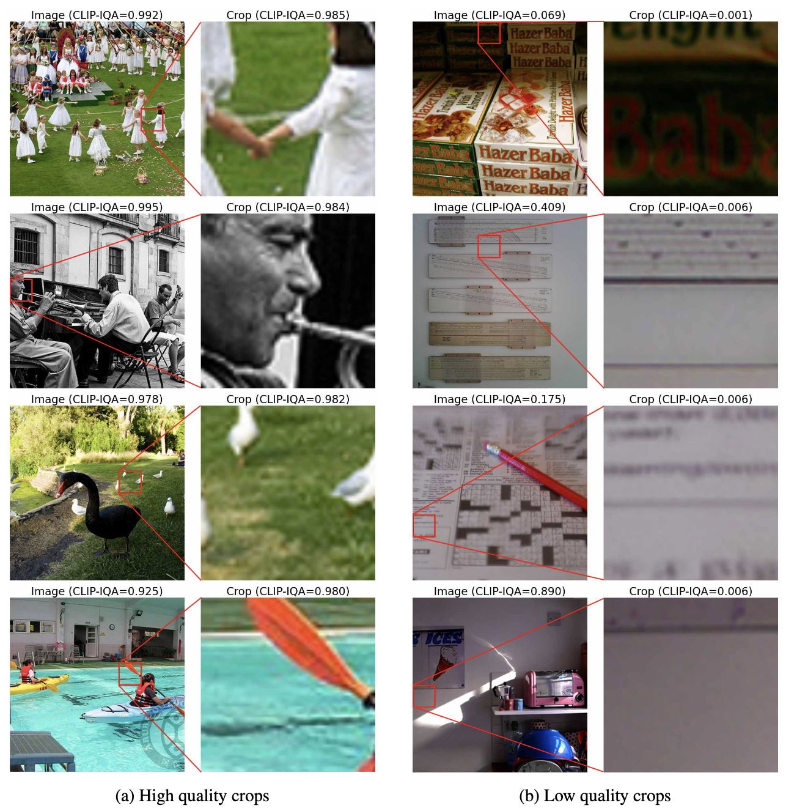
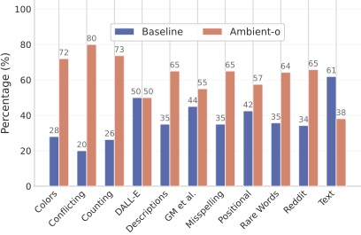
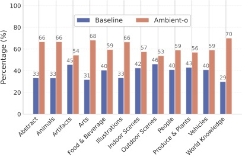

<!-- markdownlint-disable first-line-h1 -->
<!-- markdownlint-disable html -->
<!-- markdownlint-disable no-duplicate-header -->

  

## Filter not

It's well-known that **the secret sauce in training high-quality generative models is the data**. By that, we typically mean that we need to curate a large-scale high-quality diverse training set. But how does one do that?

The typical pipeline is to first form a big pool of candidate samples. These samples can be obtained from the Web or (if you are rich/lucky) from proprietary data sources. Once this large pool of data is formed, there goes the **filtering**. We typically filter for a lot of things, i.e. duplicates, copyrighted content, NSFW samples, etc. But the type of filtering we are interested here is the *quality* filtering.

Why do we filter for quality? We do so because we don't want low-quality images to leak in the generations of the generative model. But this leads to **data (and hence information) loss** -- low-quality images still contain useful information about the world. 

> **Key insight**: In this work, we show that there is immense value in the low-quality data that is often discarded. We introduce **Ambient-o**, a framework that uses synthetic, low-quality, and out-of-distribution data to improve diffusion models.

## Sample quality varies

We start by observing that **even within the same dataset image quality varies**. For example, let's take a look at images from the all-time-favorite ImageNet dataset:

  

The images on the left are of higher quality than the images on the right -- yet they all belong in the same dataset and are currently used as equal in the training algorithms of ImageNet generative models. To be formal, one would need to define what a "high-quality" image really is and there have been a lot of attempts in the Computer Vision literature to do so. 

Here, we refrain from this hard task by showing examples of what is and what isn't a high-quality image. We would like to have a model that produces samples that have the quality of the images on the left without sacrificing diversity. 

**Here is what Ambient-o does in comparison to the baseline:**

  

Our model **increases the quality of the generations without any changes** in the architecture, training/sampling hyperparameters or the optimization algorithm. The benefit comes solely from using cleverly the available data. But how do we do that?

## Learning in the high-noise regime

The first key idea of our work is that **low-quality images can be used to train for high-noise diffusion times**.

This is because **distribution distances contract under noise**. We can train a classifier to find the merging point for each sample, like below:

  

or we can select the merging point for different samples heuristically if we want to avoid the classifier training/annotation.

Once we annotate our samples (dataset preprocessing step), we can launch the diffusion training where **different images are used for different subsets of the diffusion times**, as shown below.

  

### Synthetic data

Synthetic data can be viewed as *"low-quality"* versions of real samples. Hence, we can use synthetic data for certain diffusion times, **borrowing the diversity of the synthetic generations without sacrificing the image quality**. This is what we do for our text-to-image results.

## Learning in the low-noise regime

How about the low-noise regime of the diffusion training? As we show in the paper, **for low noise the diffusion model only looks at crops** to perform the denoising.

### Out of distribution images

One nice consequence of the fact that the diffusion model only looks at crops for low noise is that we can **leverage crops from out-of-distribution images**, as long as locally they look like they are coming from the distribution of interest.

For example, we can use crops of cats to make a generative model for dogs! Below we show the "dogness" probability for different patches for a cat image.

  

As shown, **some of the crops from this cat are useful for learning dog features** in the low-noise regime of the diffusion.

### High-quality crops

Images that might be overall low-quality can still contain useful patches. These patches can be used to train the diffusion model in the low-noise part of the diffusion trajectory. Below, we show examples of low-quality and high-quality crops from ImageNet.

  

## Results

Our model does fairly well in both unconditional/class-conditional and text-conditional settings. For example, **these are the obtained FIDs on ImageNet**:

| ImageNet-512 | Train FID ↓ |  | |  | Test FID ↓ |  |  |  | Model Size |  |
|---|---|---|---|---|---|---|---|---|---|---|
|  | **FID** |  | **FIDv2** |  | **FID** |  | **FIDv2** |  |  |  |
|  | **no CFG** | **w/ CFG** | **no CFG** | **w/ CFG** | **no CFG** | **w/ CFG** | **no CFG** | **w/ CFG** | **Mparams** | **NFE** |
| EDM2-XS | **3.57** | 2.91 | **103.39** | 79.94 | 3.77 | 3.68 | 115.16 | 93.86 | 125 | 63 |
| Ambient-o-XS 🔥 | 3.59 | **2.89** | 107.26 | **79.56** | **3.69** | **3.58** | **115.02** | **92.96** | 125 | 63 |
| EDM2-XXL | 1.91 (1.93) | 1.81 | 42.84 | 33.09 | 2.88 | 2.73 | 56.42 | 46.22 | 1523 | 63 |
| Ambient-o-XXL 🔥 | 1.99 | 1.87 | 43.38 | 33.34 | 2.81 | 2.68 | 56.40 | 46.02 | 1523 | 63 |
| Ambient-o-XXL+crops 🔥 | **1.91** | **1.80** | **42.84** | **32.63** | **2.78** | **2.53** | **56.39** | **45.78** | 1523 | 63 |

Our text-to-image model **significantly surpasses the quality** of the model that treats all the data the same according to GPT-4o and other evals in the paper. This is solely because we use synthetic data as low-quality data.

  

  

## Concluding Thoughts

Is it possible to get good generative models from bad data? 
Our framework extracts value from low-quality, synthetic, and out-of-distribution sources.
At a time when the ever-growing data demands of GenAI are at odds with the need for quality control, Ambient-o lights a path for both to be achieved simultaneously. 

Are we learning something from nothing? Not quite. High-quality images provide sharpness. Low-quality ones bring diversity. We squeeze as much value as possible from our data — instead of filtering it out or treating all samples equally.

<!-- ## TL;DR

- **No filtering required:** Ambient-o achieves strong performance without the need for data filtering or curation, enabling training directly on raw, unfiltered datasets.

- **Better use of synthetic data:** Ambient-o uses synthetic data as noisy data. This has the effect of increasing the output diversity without sacrificing quality or introducing artifacts.

- **Utilizes out-of-distribution images:** Ambient-o can incorporate out-of-distribution (OOD) images during training to improve model performance -- i.e. we show that we can use cats to improve a generative model for dogs. -->

## Acknowledgements

We used the [EDM codebase](https://github.com/NVlabs/edm) for our pixel diffusion experiments, the [EDM-2](https://github.com/NVlabs/edm2) codebase for our ImageNet experiments and the [Microdiffusion](https://github.com/SonyResearch/micro_diffusion) codebase for our text-to-image results. 

We thank the authors for making their work publicly available.

