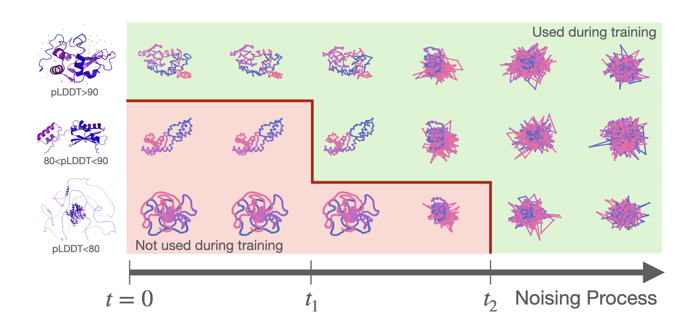
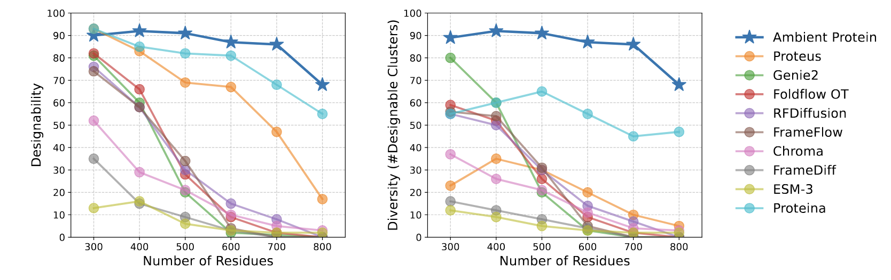
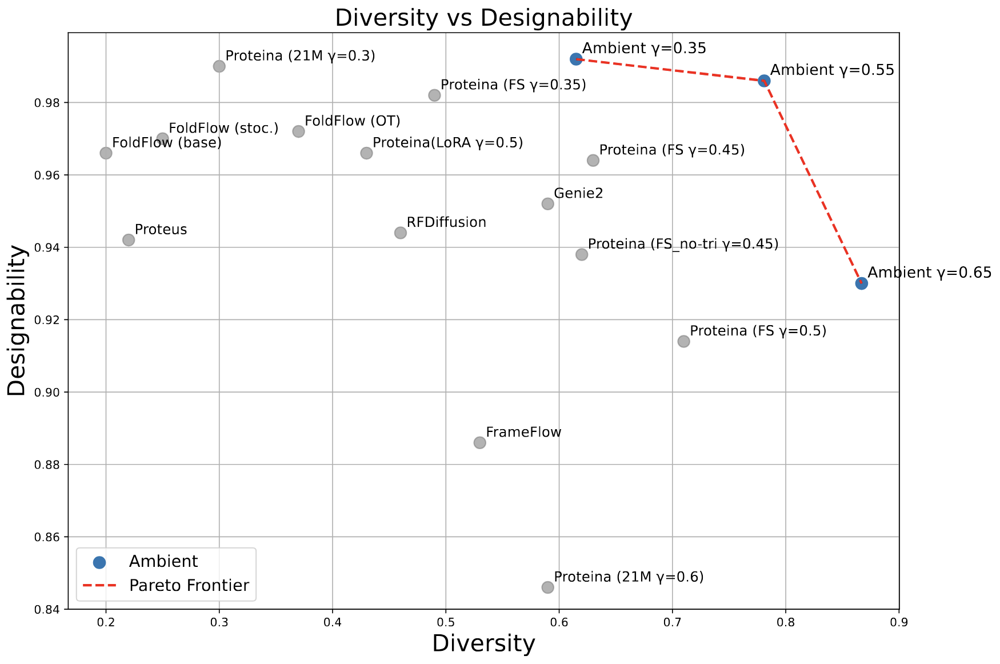
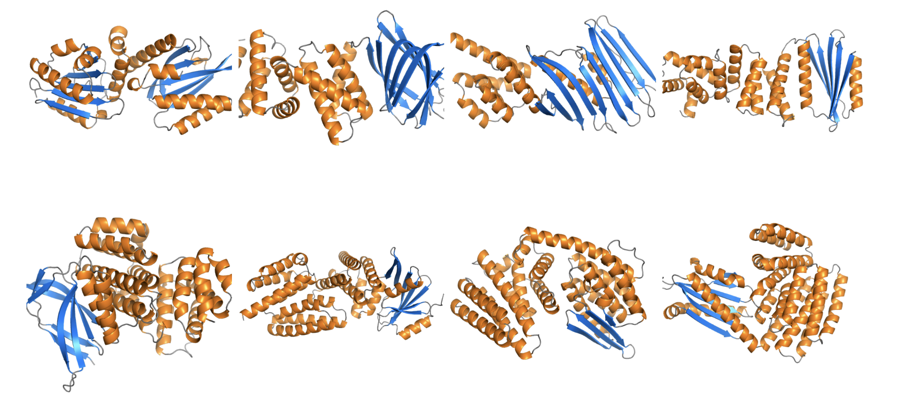

<!-- markdownlint-disable first-line-h1 -->
<!-- markdownlint-disable html -->
<!-- markdownlint-disable no-duplicate-header -->

Announcing **Ambient Protein Diffusion**, a state-of-the-art 17M-params generative model for protein structures.
<div align="center">
  
</div>


Diversity improves by 91% and designability by 26% over previous 200M SOTA model for long proteins. The trick? We treat low pLDDT AlphaFold predictions as low-quality data.

## Main Idea

- Obtaining large structure datasets experimentally is impossible.

- SOTA protein structure models are trained on AFDB (214M AlphaFold predicted structures) subsets.

- AF accuracy drops with increasing protein length and complexity, making it hard to generate such proteins.

- Ambient Protein Diffusion treats low pLDDT AF structures as low-quality data.

- Instead of filtering them out (as done in prior work), we use them for a subset of the diffusion times. 

<div align="center">
  
</div>

Enough noise "erases" the AF mistakes, and we can still learn from those structures.


## Results

The results are quite strong. 

Ambient Protein Diffusion substantially outperforms previous baselines in short and long protein generation. 


<div align="center">
  
</div>


For short proteins, we dominate the Pareto frontier between designability and diversity, using a ~13x smaller model than previous SOTA.


<div align="center">
  
</div>

Here are some qualitative samples from our model:

<div align="center">
  
</div>


## Models

The following pre-trained Ambient Protein Diffusion models are available for download.
```bash
huggingface-cli download jozhang97/ambient-long --local-dir runs/ambient_long
huggingface-cli download jozhang97/ambient-short --local-dir runs/ambient_short
```

Detailed instructions on how to use the models can be found in the [official code repository](https://github.com/jozhang97/ambient-proteins) of the project.


## Citation

If you use Ambient Protein Diffusion in your research, please cite our paper:

```bibtex
@article{daras2025ambient,
  title={Ambient Proteins: Training Diffusion Models on Low Quality Structures},
  author={Daras, Giannis and Ouyang-Zhang, Jeffrey and Ravishankar, Krithika and Daspit, William and Daskalakis, Costis and Liu, Qiang and Klivans, Adam and Diaz, Daniel J},
  doi={10.1101/2025.07.03.663105},
  journal={bioRxiv},
  publisher={Cold Spring Harbor Laboratory},
  year={2025}
}
```


