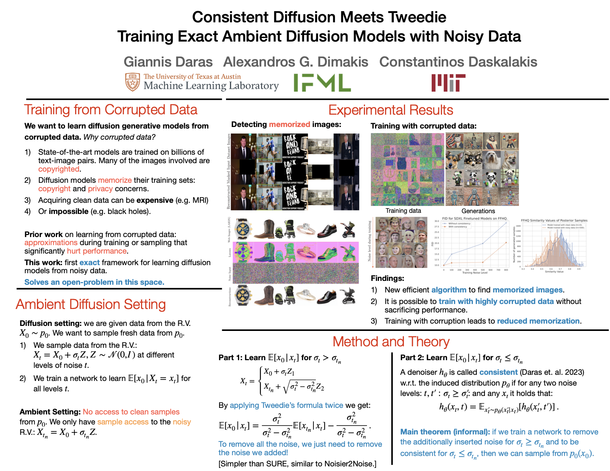

> Ambient diffusion is a recently proposed framework for training diffusion models using corrupted data. Both Ambient Diffusion and alternative SURE-based approaches for learning diffusion models from corrupted data resort to approximations which deteriorate performance. We present the first framework for training diffusion models that provably sample from the uncorrupted distribution given only noisy training data, solving an open problem in this space. Our key technical contribution is a method that uses a double application of Tweedie's formula and a consistency loss function that allows us to extend sampling at noise levels below the observed data noise. We also provide further evidence that diffusion models memorize from their training sets by identifying extremely corrupted images that are almost perfectly reconstructed, raising copyright and privacy concerns. Our method for training using corrupted samples can be used to mitigate this problem. We demonstrate this by fine-tuning Stable Diffusion XL to generate samples from a distribution using only noisy samples. Our framework reduces the amount of memorization of the fine-tuning dataset, while maintaining competitive performance.

Please read the [paper](https://arxiv.org/abs/2404.10177) for more details.