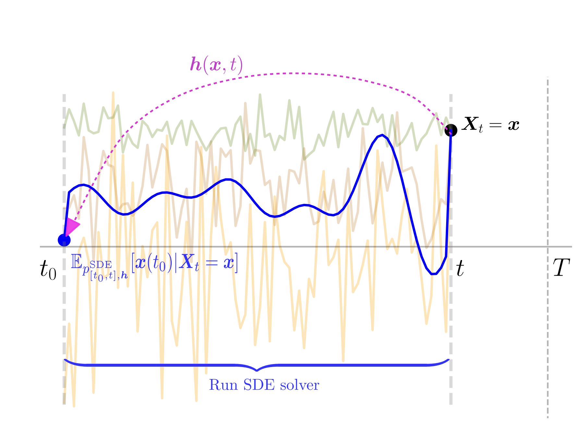

(Image source: [On the Equivalence of Consistency-Type Models](https://arxiv.org/pdf/2306.00367.pdf))

> Imperfect score-matching leads to a shift between the training and the sampling distribution of diffusion models. Due to the recursive nature of the generation process, errors in previous steps yield sampling iterates that drift away from the training distribution. Yet, the standard training objective via Denoising Score Matching (DSM) is only designed to optimize over non-drifted data. To train on drifted data, we propose to enforce a **consistency** property which states that predictions of the model on its own generated data are consistent across time. Theoretically, we show that if the score is learned perfectly on some non-drifted points (via DSM) and if the consistency property is enforced everywhere, then the score is learned accurately everywhere. Empirically we show that our novel training objective yields state-of-the-art results for conditional and unconditional generation in CIFAR-10 and baseline improvements in AFHQ and FFHQ. 

Please read the [paper](https://arxiv.org/abs/2302.09057) for more details.