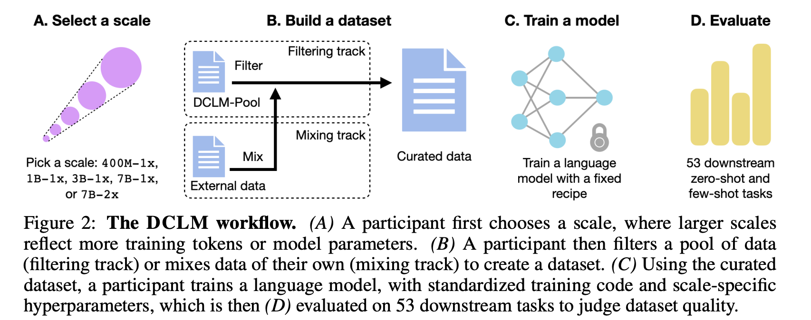

> We introduce DataComp for Language Models (DCLM), a testbed for controlled dataset experiments with the goal of improving language models. As part of DCLM, we provide a standardized corpus of 240T tokens extracted from Common Crawl, effective pretraining recipes based on the OpenLM framework, and a broad suite of 53 downstream evaluations. Participants in the DCLM benchmark can experiment with data curation strategies such as deduplication, filtering, and data mixing at model scales ranging from 412M to 7B parameters. As a baseline for DCLM, we conduct extensive experiments and find that model-based filtering is key to assembling a high-quality training set. The resulting dataset, DCLM-BASELINE, enables training a 7B parameter language model from scratch to 64% 5-shot accuracy on MMLU with 2.6T training tokens. Compared to MAP-Neo, the previous state-of-the-art in open-data language models, DCLM-BASELINE represents a 6.6 percentage point improvement on MMLU while being trained with 40% less compute. Our baseline model is also comparable to Mistral-7B-v0.3 and Llama 3 8B on MMLU (63% & 66%), and performs similarly on an average of 53 natural language understanding tasks while being trained with 6.6× less compute than Llama 3 8B. Our results highlight the importance of dataset design for training language models and offer a starting point for further research on data curation.

Please read the [paper](https://arxiv.org/abs/2406.11794) for more details.

