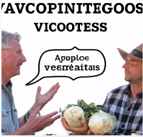
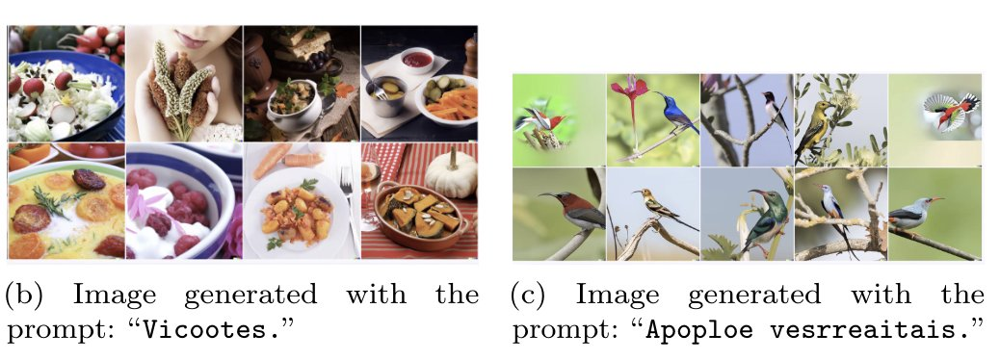
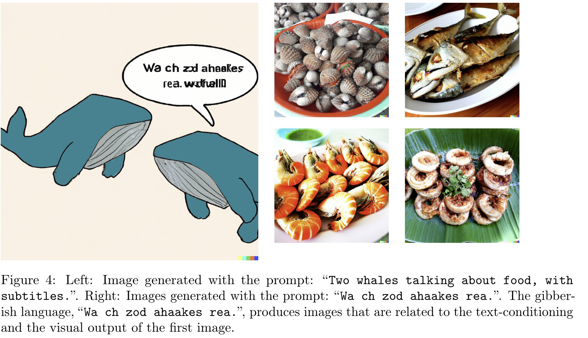

We discover that DALLE-2 seems to have a hidden vocabulary that can be used to generate images with absurd prompts. For example, it seems that **Apoploe vesrreaitais** means birds and **Contarra ccetnxniams luryca tanniounons** (sometimes) means bugs or pests. 

The prompt: "Apoploe vesrreaitais eating Contarra ccetnxniams luryca tanniounons" gives images of birds eating bugs. 

A known limitation of DALLE-2 is that it struggles with text. For example, the prompt: "Two farmers talking about vegetables, with subtitles" gives an image that appears to have gibberish text on it. 

However, the text is not as random as it initially appears.

We feed the text "Vicootes" from the previous image to DALLE-2. Surprisingly, we get (dishes with) vegetables! We then feed the words: "Apoploe vesrreaitars" and we get birds. It seems that the farmers are talking about birds, messing with their vegetables! 

Another example: "Two whales talking about food, with subtitles". We get an image with the text "Wa ch zod rea." written on it. Apparently, the whales are actually talking about their food in the DALLE-2 language.

Some words from the DALLE-2 language can be learned and used to create absurd prompts. For example, "painting of Apoploe vesrreaitais" gives a painting of a bird. "Apoploe vesrreaitais" means to the model "something that flies" and can be used across diverse styles.

The discovery of the DALLE-2 language creates many interesting security and interpretability challenges. 

Currently, NLP systems filter text prompts that violate the policy rules. Gibberish prompts may be used to bypass these filters.

For a more detailed discussion, see:

* [Twitter thread](https://twitter.com/giannis_daras/status/1531693093040230402)
* [Twitter thread: Responses to criticism](https://twitter.com/giannis_daras/status/1532605363232444416)

Recommended videos/texts regaring this:

* [Youtube video](https://www.youtube.com/watch?v=MNwURQ9621k)
* [Hacker news thread](https://news.ycombinator.com/item?id=31573282)
