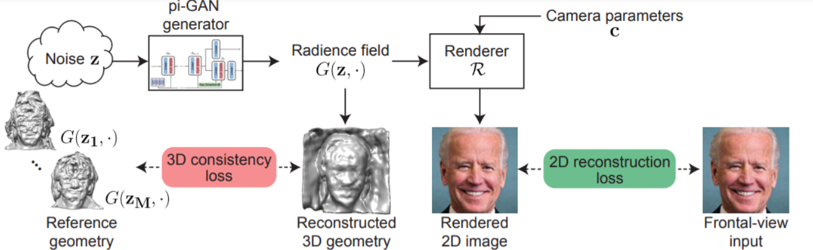
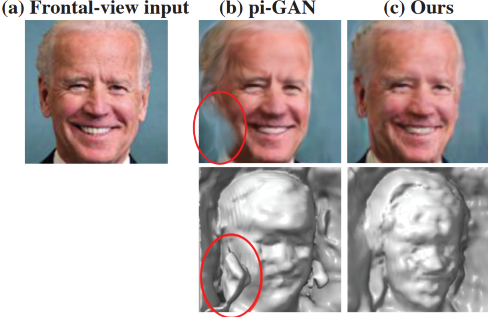

We introduce a novel framework for solving inverse problems using NeRF-style generative models. We are interested in the problem of 3-D scene reconstruction given a single 2-D image and known camera parameters. We show that naively optimizing the latent space leads to artifacts and poor novel view rendering. We attribute this problem to volume obstructions that are clear in the 3-D geometry and become visible in the renderings of novel views. We propose a novel radiance field regularization method to obtain better 3-D surfaces and improved novel views given single view observations. Our method naturally extends to general inverse problems including inpainting where one observes only partially a single view. We experimentally evaluate our method, achieving visual improvements and performance boosts over the baselines in a wide range of tasks. Our method achieves 30−40% MSE reduction and 15−25% reduction in LPIPS loss compared to the previous state of the art.

