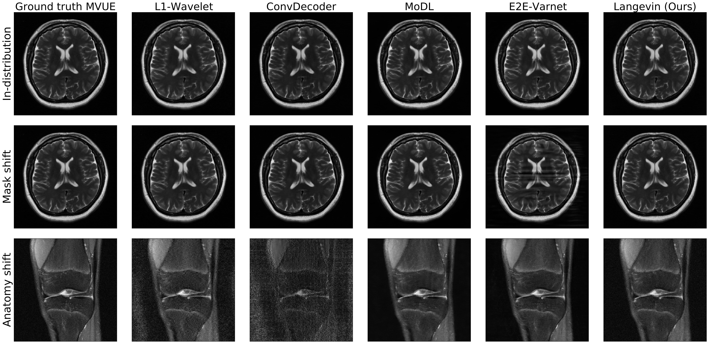

The CSGM framework (Bora-Jalal-Price-Dimakis'17) has shown that deep generative priors can be powerful tools for solving inverse problems. However, to date this framework has been empirically successful only on certain datasets (for example, human faces and MNIST digits), and it is known to perform poorly on out-of-distribution samples. In this paper, we present the first successful application of the CSGM framework on clinical MRI data. We train a generative prior on brain scans from the fastMRI dataset, and show that posterior sampling via Langevin dynamics achieves high quality reconstructions. Furthermore, our experiments and theory show that posterior sampling is robust to changes in the ground-truth distribution and measurement process.

