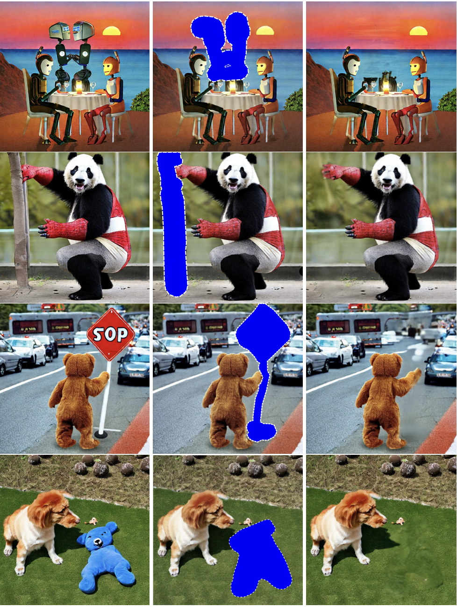

> We present the first framework to solve linear inverse problems leveraging pre-trained latent diffusion models. Previously proposed algorithms (such as DPS and DDRM) only apply to pixel-space diffusion models. We theoretically analyze our algorithm showing provable sample recovery in a linear model setting. The algorithmic insight obtained from our analysis extends to more general settings often considered in practice. Experimentally, we outperform previously proposed posterior sampling algorithms in a wide variety of problems including random inpainting, block inpainting, denoising, deblurring, destriping, and super-resolution.

Please read the [paper](https://arxiv.org/abs/2307.00619) for more details.